# DAG 依赖图

## 完整依赖图

```mermaid
graph TD
    CASCADE.x --> CASCADE.y1
    CASCADE.p1 --> CASCADE.y1
    CASCADE.y1 --> CASCADE.y2
    CASCADE.x --> CASCADE.y2
    CASCADE.p2 --> CASCADE.y2
    CASCADE.y2 --> CASCADE.y_final
    MATH_DEMO.t --> MATH_DEMO.y_damped
    MATH_DEMO.p1 --> MATH_DEMO.y_damped
    MATH_DEMO.p3 --> MATH_DEMO.y_damped
    MATH_DEMO.p2 --> MATH_DEMO.y_damped
    MATH_DEMO.x --> MATH_DEMO.y_tanh
    MATH_DEMO.p1 --> MATH_DEMO.y_tanh
    MATH_DEMO.x --> MATH_DEMO.theta
    MATH_DEMO.t --> MATH_DEMO.theta
    MATH_DEMO.x --> MATH_DEMO.y_round
    MATH_DEMO.t --> MATH_DEMO.y_round
    MATH_DEMO.x --> MATH_DEMO.y_sign
    MATH_DEMO.x --> MATH_DEMO.y_log
    MATH_DEMO.t --> MATH_DEMO.y_log
    MATH_DEMO.x --> MATH_DEMO.y_relu
    MATH_DEMO.t --> MATH_DEMO.y_mod
    MATH_DEMO.x --> MATH_DEMO.y_asin
    MATH_DEMO.t --> MATH_DEMO.y_exp
    MATH_DEMO.p3 --> MATH_DEMO.y_exp
    PHOTO.reserve_ratio --> PHOTO.Pmax_l
    PHOTO.p1 --> PHOTO.Pmax_l
    PHOTO.p2 --> PHOTO.Pmax_l
    PHOTO.Pmax_l --> PHOTO.A_leaf
    PHOTO.ppfd --> PHOTO.A_leaf
    PHOTO.p3 --> PHOTO.A_leaf
    PHOTO.p4 --> PHOTO.A_leaf
```

## 计算顺序

1. `PHOTO.ppfd`
2. `PHOTO.reserve_ratio`
3. `PHOTO.p3`
4. `PHOTO.p1`
5. `PHOTO.p2`
6. `PHOTO.Pmax_l`
7. `PHOTO.p4`
8. `PHOTO.A_leaf`
9. `MATH_DEMO.x`
10. `MATH_DEMO.y_asin`
11. `MATH_DEMO.y_relu`
12. `MATH_DEMO.y_sign`
13. `MATH_DEMO.t`
14. `MATH_DEMO.y_mod`
15. `MATH_DEMO.y_log`
16. `MATH_DEMO.y_round`
17. `MATH_DEMO.theta`
18. `MATH_DEMO.p3`
19. `MATH_DEMO.y_exp`
20. `MATH_DEMO.p2`
21. `MATH_DEMO.p1`
22. `MATH_DEMO.y_tanh`
23. `MATH_DEMO.y_damped`
24. `CASCADE.x`
25. `CASCADE.p2`
26. `CASCADE.p1`
27. `CASCADE.y1`
28. `CASCADE.y2`
29. `CASCADE.y_final`